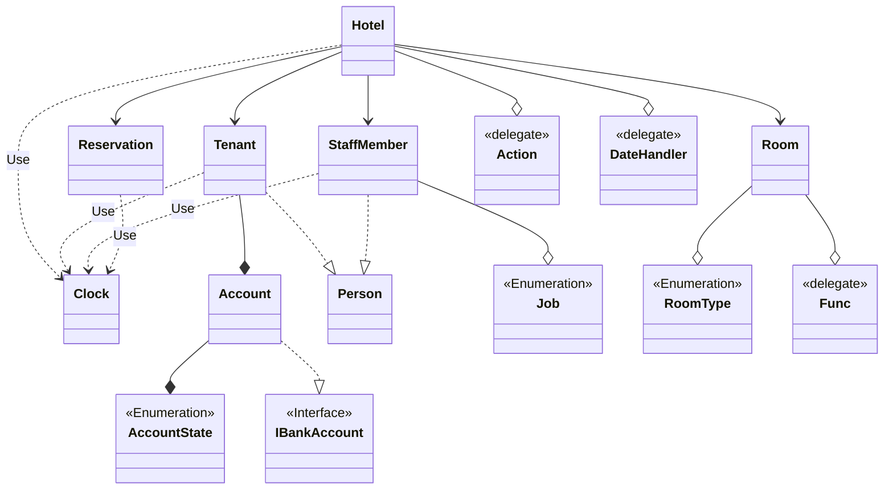
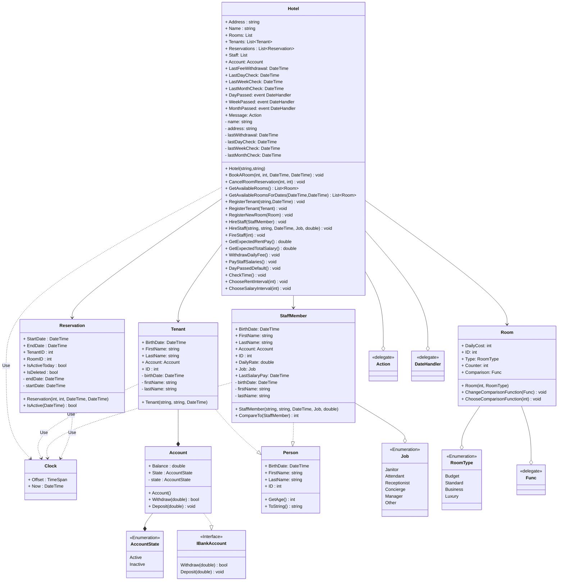

# **Опис предметної області**
У цьому проекті розробляється реалізація предметної області, що описує готель. Після аналізу поданої предметної області було виокремлено 5 основних класи:
1.	Hotel (Готель, як організація, що надає послуги з короткочасного проживання клієнтів  у мебльованих кімнатах. Головний клас цієї предметної області.);
1.	Room (Кімната готелю, що здається в оренду);
1.  StaffMember (Робітник готелю);
1.	Tenant (Жилець готелю, він же клієнт);
1.	Reservation (Запис, який характеризує бронювання номеру(кімнати) на обмежений відрізок часу. Клас, що поєднує усі попередні класи, та є необхідним для роботи готелю)

Було також визначено всі необхідні для роботи основних класів перелічення, інтерфейси та класи, а також типи зв’язків між ними. На основі цього, було побудовано діаграму класів, яку можна побачити на рисунку 1:

Рисунок 1 – Виявлення та визначення елементів предметної області та зв’язки між ними

Для кожного з присутніх на діаграмі класів елементу було визначено його властивості та поведінку, які було позначено на діаграмі класів. Результат можна побачити на рисунку 2:

Рисунок 2 – Детальне проєктування елементів моделі предметної області

Далі наведено пояснення щодо кожного елементу моделі предметної області:

**AccountState**

Опис: Перелічення, що характеризує стан банківського рахунку.

Значення:
-	Active – рахунок є активним, з ним можна проводити операції;
-	Inactive – рахунок є замороженим, з ним не можна проводити операції.

**IBankAccount**

Опис: Інтерфейс, що характеризує поведінку банківського рахунку.

Методи:
-	Deposit(double) – зараховує на баланс рахунку певну кількість грошей;
-	Withdraw(double) – знімає з балансу рахунку певну кількість грошей.

**Account**

Опис: Клас, що характеризує грошовий рахунок жильця готелю. Реалізує інтерфейс IBankAccount.

Поля:
- state – стан рахунку.

Властивості: 
-	Balance – кількість грошей на рахунку. Якщо це значення є від’ємним, то клієнт має борг перед готелем;
-	State – публічна властивість для поля state;

Методи:
-	Account () – конструктор класу, що призначає створеному об’єкту значення властивостей за замовчуванням;
-	Deposit(double) – зараховує на баланс рахунку певну кількість грошей. Кількість грошей не може бути від’ємною;
-	Withdraw(double) – знімає з балансу рахунку певну кількість грошей. Кількість грошей не може бути від’ємною, та не може бути більшою, аніж наявна кількість грошей на рахунку.

**Person**

Опис: Абстрактний клас, що характеризує людину.

Властивості: 
- BirthDate – дата народження людини. 
-	FirstName – ім’я людини.
-	LastName – прізвище людини. 
- ID – ідентифікаційний номер, що характеризує створений об'єкт класу.

Методи:
-	GetAge() – розраховує та повертає вік особи;
-	ToString() – повертає опис об'єкта у вигляді рядка.
  
**Tenant**

Опис: Клас, що характеризує жильця готелю. Спадкує абстрактний клас Person.

Поля:
- birthDate – дата народження клієнту. Вік клієнту не має бути вищим за 120 років, а сам клієнт має бути повнолітнім. Так само, дата народження клієнту не може бути у майбутньому;
-	firstName – ім’я клієнту. Має складатися з 3-12 символів, та має містити лише латинські літери;
-	lastName – прізвище клієнту. Має складатися з 3-12 символів, та має містити лише латинські літери;
  
Властивості: 
- BirthDate – публічна властивість для поля birthDate (успадкована від Person);
-	FirstName – публічна властивість для поля firstName (успадкована від Person);
-	LastName – публічна властивість для поля lastName (успадкована від Person);
- Account – грошовий рахунок всередині готелю;
-	ID – унікальний ідентифікаційний номер (успадкована від Person);
-	Counter – статична властивість, що вказує на кількість зареєстрованих у системі клієнтів (використовується для генерації ID клієнту.

Методи:
-	Tenant (string, string, DateTime) – конструктор класу, що призначає створеному об’єкту ім’я, дату народження, грошовий рахунок та ідентифікаційний номер.
-	GetAge() – розраховує та повертає вік особи (успадковано від класу Person);
-	ToString() – повертає опис об'єкта у вигляді рядка (успадковано від класу object).

**Job**

Опис: Перелічення, що характеризує професію робітника готелю.

Значення:
- Janitor – Прибиральник;
- Attendant – Обслуговуючий персонал;
- Receptionist – Порт'є
- Concierge – Консьерж
- Manager – Менеджео
- Other – Інше

**StaffMember**

Опис: Клас, що характеризує робітника готелю. Спадкує абстрактний клас Person.

Поля:
- birthDate – дата народження робітника. Вік клієнту не має бути вищим за 120 років, а сам робітник має бути повнолітнім. Так само, дата народження працівника не може бути у майбутньому;
-	firstName – ім’я робітника. Має складатися з 3-12 символів, та має містити лише латинські літери;
-	lastName – прізвище робітника. Має складатися з 3-12 символів, та має містити лише латинські літери;
-	job – професія робітника;
-	salary – заробітна плата робітника у $/день. Не може бути від'ємною;
-	lastSalary – дата останньої виплати заробітної плати. Не може бути у майбутньому.
  
Властивості: 
- BirthDate – публічна властивість для поля birthDate (успадкована від Person);
-	FirstName – публічна властивість для поля firstName (успадкована від Person);
-	LastName – публічна властивість для поля lastName (успадкована від Person);
- Account – грошовий рахунок всередині готелю;
-	ID – унікальний ідентифікаційний номер (успадкована від Person);
-	Job –  публічна властивість для поля job;
-	DailyRate –  публічна властивість для поля salary;
-	LastSalaryPay –  публічна властивість для поля lastSalary;
-	IsFire – властивість, яка визначає, чи було цього працівника звільнено з його посади;
-	Counter – статична властивість, що вказує на кількість зареєстрованих у системі клієнтів (використовується для генерації ID клієнту.

Методи:
-	StaffMember (string,string, DateTime, Job, double) – конструктор класу, що призначає створеному об’єкту ім’я, прізвище, дату народження, професію, заробітну плату, грошовий рахунок та ідентифікаційний номер.
-	GetAge() – розраховує та повертає вік особи (успадковано від класу Person);
-	ToString() – повертає опис об'єкта у вигляді рядка (успадковано від класу object).

**RoomType**

Опис: Перелічення, що характеризує економічний клас номеру готелю.

Значення:
-	Budget – економ клас, у номері присутні лише необхідні для проживання речі;
-	Standard – стандартний клас, у номері присутні необхідні для проживання речі, деякі зручності, а також власний санвузол;
-	Business – номер бізнес класу, у номері присутні необхідні для проживання речі, всі зручності, та власний санвузол;
-	 Luxury – номер класу люкс, містить все, що і бізнес клас, але має більше приміщень, кращі дизайн та якість меблів.

**Room**

Опис: Клас, що характеризує номер готелю. Реалізує інтерфейси IComparable, IClonable.

Поля:
-	dailyCost – ціна оренди номеру за один день. Не може бути від’ємною;
-	type – економічний клас номеру готелю;
- Comparison – статичний делегат(функція), який використовується для порівняння двух об'єктів типу Room.

Властивості: 
-	DailyCost –  публічна властивість для поля dailyCost;
-	ID – унікальний ідентифікаційний номер;
-	Type – публічна властивість для поля type;
-	Counter – статична властивість, що вказує на кількість зареєстрованих у системі номерів (використовується для генерації ID номеру).

Методи:
-	Room (int, RoomType) – конструктор класу, що призначає створеному об’єкту ціну оренди,  економічний клас та ідентифікаційний номер;
-	Clone () – створює та повертає кімнату, яка ідентична данній;
-	CompareTo(Room) – порівнює цю кімнату з іншою за ціною оренди.
-	ChooseComparisonFunction – змінює метод, який використовує делегат Comparison

**Reservation**

Опис: Клас, що характеризує запис бронювання номеру готелю.
Поля:
-	startDate – початкова дата бронювання. Не може бути у минулому;
-	endDate – кінцева дата бронювання. Не може бути раніше, аніж початкова та не може бути пізнішою початкової менше, аніж на 1 добу;

Властивості: 
-	StartDate – публічна властивість для поля startDate;
-	EndDate – публічна властивість для поля endDate;
-	RoomID – ідентифікаційний номер кімнати, що бронюється;
-	TenantID – ідентифікаційний номер жильця готелю, що бронює;
-	TodayIsActive – вказує, чи є бронювання активним прямо зараз;
-	IsDeleted – вказує, чи бронювання було скасовано чи воно вже завершилось.

Методи:
-	Reservation (int, int, DateTime, DateTime) – конструктор класу, що призначає створеному об’єкту початкову та кінцеву дати, ідентифікатор клієнта та номеру;
- IsActive (DateTime) – вказує, чи є бронювання активним у певну дату.

**Hotel**

Опис: Клас, що характеризує готель.

Поля:
-	name – Назва готелю. Має складатися з 3-30 символів латинського алфавіту та може містити пробіли;
-	address – Адреса готелю. Складається з 4 частин, розділених комою. Перша частина – номер будинку, має складатися з 1-4 цифр та літер латинського алфавіту. Друга частина – назва вулиці, має складатися з 5-20 латинських літер та може містити пробіли. Третя частина – назва міста, має містити 3-12 символів латинського алфавіту та може мати пробіли. Четверта частина – назва країни, має такі ж обмеження, що і назва міста;
-	lastWithdral – Дата останнього взяття орендною плати з жильців готелю.
- lastDayCheck – Дата останньої автоматичної щодневної виплати;
- lastWeekCheck – Дата останньої автоматичної щотижневої виплати
- lastMonthCheck – Дата останньої автоматичної щомісячної виплати
- DayPassed – Подія, що спрацьовує кожен день. До цієї події призначаються виплати оренди та заробітної плати.
- WeekPassed – Подія, що спрацьовує кожен тиждень. До цієї події призначаються виплати оренди та заробітної плати.
- MonthPassed – Подія, що спрацьовує кожен місяць. До цієї події призначаються виплати оренди та заробітної плати.
- Message – Делегат, призначений для виводу повідомлень.

Властивості: 
-	Name – публічна властивість для поля name;
-	Address – публічна властивість для поля address;
-	Rooms – список зареєстрованих кімнат;
-	Tenants – список зареєстрованих жильців;
-	Staff – список зареєстрованих працівників готелю;
-	Reservations – список записів бронювання кімнат;
-	LastRentWithdrawal – публічна властивість для поля lastWithdrawal;
-	Account – банківський рахунок готелю.
-	LastWithdral –  публічна властивість для поля lastWithdrawal.
- LastDayCheck –  публічна властивість для поля lastDayCheck.
- LastWeekCheck –  публічна властивість для поля lastWeekCheck.
- LastMonthCheck –  публічна властивість для поля lastMonthCheck.

Методи:
-	Hotel (string, string) – конструктор класу, що призначає створеному об’єкту назву та адресу.
-	BookARoom(int, int, DateTime, DateTime) – метод, що бронює кімнату з зареєстрованим ідентифікаційним номером на клієнта з зареєстрованим номером, на певний проміжок часу. І клієнт і кімната мають бути зареєстрованими у цьому готелі;
-	CancelRoomReservation(int,int) – метод, що скасовує всі записи бронювання кімнати з певним номером, які зробив клієнт з певним номером. Скасовані записи позначаються як IsDeleted, але залишаються у списку;
-	GetAvailableRoomsForDates(DateTime, DateTime) – метод, що повертає список кімнат, які є повністю вільними на певному проміжку часу;
-	GetAvailableRooms() – метод, що повертає список кімнат, які є повністю вільними сьогодні;
-	RegisterTenant (Tenant), RegisterTenant(string, string, DateTime) – методи, що реєструють клієнта у готелі. Клієнт не може бути вже зареєстрованим;
-	RegisterNewRoom (Room) – метод, що реєструє нову кімнату у готелі. Кімната не може бути вже зареєстрованою;
-	WithdrawRoomRent() – метод, що, починаючи з останньої дати взяття орендної плати, списує з рахунку клієнтів, у яких в той день було активне бронювання, гроші, рівні добовій вартості проживання в орендованій кімнаті. Якщо це призводить до заборгованості клієнта, його оренда скасовується, а номер звільняється. Всі списані гроші попадають на рахунок готелю;
- HireStaff(StaffMember), HireStaff(string, string, DateTime, Job, double) – метод, що реєструє робітника у готелі;
- FireStaff(int) – метод, що звільняє робітника з певним ідентифікаційним номером;
- GetExpectedRentPay() – метод, що повертає загальну орендну плату, які жильці готелю мають сплатити, починаючи з дати останнього взяття орендної плати;
- GetExpectedTotalSalary() – метод, що повертає загальну заробітну плату, яку готель має виплатити своїм робітникам.
- PayStaffSalaries() – метод, що виплачує з рахунку готелю всім працівникам їх заробітну плату. Якщо грошей на рахунку недостатньо, кожному працівнику оплачується кількість робочих дней, пропорційна його заробітній платі та даті останньої виплати заробітної плати.
- DayPassedDefault() – метод, який завжди викликається при спрацюванні події DayPassed. Якщо з останньої щотижневої виплати пройшло більше тижня, то запускає подію WeekPassed. Якщо з останньої щомісячної виплати пройшло більше місяця, то запускає подію MonthPassed.
- CheckTime() – метод, що запускає подію DayPassed для кожного дня, починаючи з останньої дати щодневної виплати, і закінчуючи теперішнім часом.
- ChooseRentInterval(int) – обирає, до якої події прив'язується виплата оренди: DayPassed, WeekPassed чи MonthPassed.
- ChooseSalaryInterval(int) – обирає, до якої події прив'язується виплата заробітної плати: DayPassed, WeekPassed чи MonthPassed.
