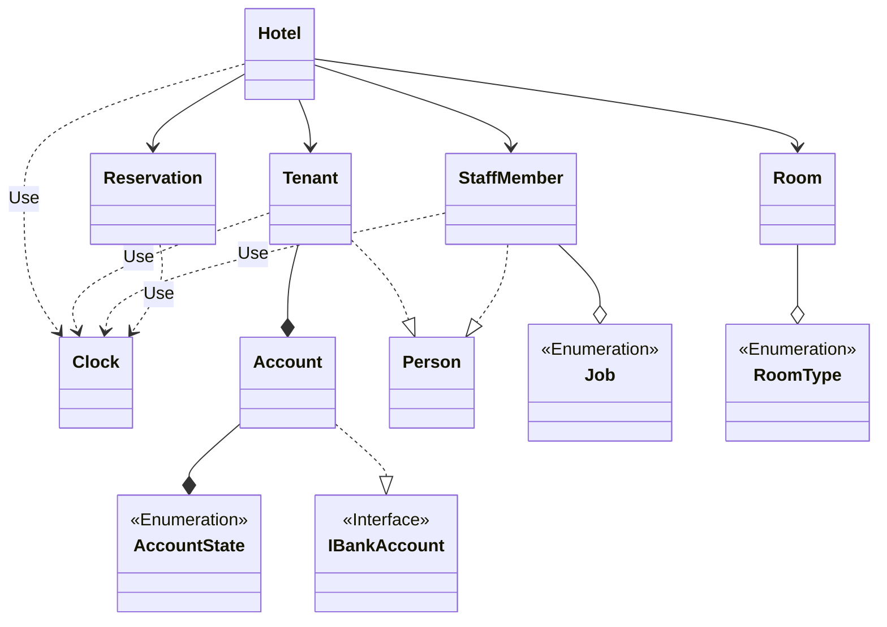
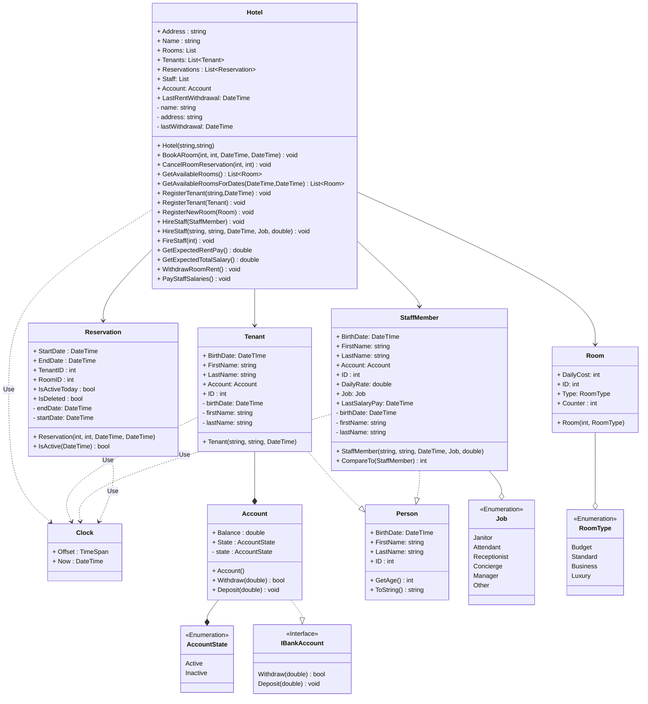

# **Опис предметної області**
У цьому проекті розробляється реалізація предметної області, що описує готель. Після аналізу поданої предметної області було виокремлено 4 основних класи:
1.	Hotel (Готель, як організація, що надає послуги з короткочасного проживання клієнтів  у мебльованих кімнатах. Головний клас цієї предметної області.);
1.	Room (Кімната готелю, що здається в оренду);
1.	Tenant (Жилець готелю, він же клієнт);
1.	Reservation (Запис, який характеризує бронювання номеру(кімнати) на обмежений відрізок часу. Клас, що поєднує усі попередні класи, та є необхідним для роботи готелю)

Було також визначено всі необхідні для роботи основних класів перелічення, інтерфейси та класи, а також типи зв’язків між ними. На основі цього, було побудовано діаграму класів, яку можна побачити на рисунку 1:

Рисунок 1 – Виявлення та визначення елементів предметної області та зв’язки між ними

Для кожного з присутніх на діаграмі класів елементу було визначено його властивості та поведінку, які було позначено на діаграмі класів. Результат можна побачити на рисунку 2:

Рисунок 2 – Детальне проєктування елементів моделі предметної області

Далі наведено пояснення щодо кожного елементу моделі предметної області:

**AccountState**

Опис: Перелічення, що характеризує стан банківського рахунку.

Значення:
-	Active – рахунок є активним, з ним можна проводити операції;
-	Inactive – рахунок є замороженим, з ним не можна проводити операції.

**IBankAccount**

Опис: Інтерфейс, що характеризує поведінку банківського рахунку.

Методи:
-	Deposit(double) – зараховує на баланс рахунку певну кількість грошей;
-	Withdraw(double) – знімає з балансу рахунку певну кількість грошей.

**Account**

Опис: Клас, що характеризує грошовий рахунок жильця готелю. Реалізує інтерфейс IBankAccount.

Властивості: 
-	OverdraftMax – статична властивість, що вказує на максимальну позику, яку може надати готель, перш аніж жильця виженуть через несплату боргів. Не може бути від’ємною;
-	Balance – кількість грошей на рахунку. Якщо це значення є від’ємним, то клієнт має борг перед готелем;
-	State – стан рахунку;

Методи:
-	Account () – конструктор класу, що призначає створеному об’єкту значення властивостей за замовчуванням;
-	Deposit(double) – зараховує на баланс рахунку певну кількість грошей. Кількість грошей не може бути від’ємною;
-	Withdraw(double) – знімає з балансу рахунку певну кількість грошей. Кількість грошей не може бути від’ємною, та не може бути більшою, аніж сума наявної кількості грошей на рахунку та максимальної допустимої позики (овердрафту).
  
**Tenant**

Опис: Клас, що характеризує жильця готелю.

Властивості: 
- BirthDate – дата народження клієнту. Вік клієнту не має бути вищим за 120 років, а сам клієнт має бути повнолітнім. Так само, дата народження клієнту не може бути у майбутньому;
-	Name – повне ім’я клієнту. Має складатися з двох слів: ім’я та прізвища, кожне має складатися з 3-12 символів, та має містити лише латинські літери;
- Account – грошовий рахунок всередині готелю;
-	ID – унікальний ідентифікаційний номер;
-	Counter – статична властивість, що вказує на кількість зареєстрованих у системі клієнтів (використовується для генерації ID клієнту.

Методи:
-	Tenant (string, DateTime) – конструктор класу, що призначає створеному об’єкту ім’я, дату народження, грошовий рахунок та ідентифікаційний номер.

**RoomType**

Опис: Перелічення, що характеризує економічний клас номеру готелю.

Значення:
-	Budget – економ клас, у номері присутні лише необхідні для проживання речі;
-	Standard – стандартний клас, у номері присутні необхідні для проживання речі, деякі зручності, а також власний санвузол;
-	Business – номер бізнес класу, у номері присутні необхідні для проживання речі, всі зручності, та власний санвузол;
-	 Luxury – номер класу люкс, містить все, що і бізнес клас, але має більше приміщень, кращі дизайн та якість меблів.

**Room**

Опис: Клас, що характеризує номер готелю.

Властивості: 
-	DailyCost – ціна оренди номеру за один день. Не може бути від’ємною;
-	ID – унікальний ідентифікаційний номер;
-	Type – економічний клас номеру готелю;
-	Counter – статична властивість, що вказує на кількість зареєстрованих у системі номерів (використовується для генерації ID номеру).

Методи:
-	Room (int, RoomType) – конструктор класу, що призначає створеному об’єкту ціну оренди,  економічний клас та ідентифікаційний номер.

**Reservation**

Опис: Клас, що характеризує запис бронювання номеру готелю.

Властивості: 
-	StartDate – початкова дата бронювання. Не може бути у минулому;
-	EndDate – кінцева дата бронювання. Не може бути раніше, аніж початкова та не може бути пізнішою початкової менше, аніж на 1 добу;
-	RoomID – ідентифікаційний номер кімнати, що бронюється;
-	TenantID – ідентифікаційний номер жильця готелю, що бронює;
-	TodayIsActive – вказує, чи є бронювання активним прямо зараз;
-	IsDeleted – вказує, чи бронювання було скасовано чи воно вже завершилось.

Методи:
-	Reservation (int, int, DateTime, DateTime) – конструктор класу, що призначає створеному об’єкту початкову та кінцеву дати, ідентифікатор клієнта та номеру.

**Hotel**

Опис: Клас, що характеризує готель.

Властивості: 
-	Name – Назва готелю. Має складатися з 3-30 символів латинського алфавіту та може містити пробіли;
-	Address – Адреса готелю. Складається з 4 частин, розділених комою. Перша частина – номер будинку, має складатися з 1-4 цифр та літер латинського алфавіту. Друга частина – назва вулиці, має складатися з 5-20 латинських літер та може містити пробіли. Третя частина – назва міста, має містити 3-12 символів латинського алфавіту та може мати пробіли. Четверта частина – назва країни, має такі ж обмеження, що і назва міста;
-	Rooms – список зареєстрованих кімнат;
-	Tenants – список зареєстрованих жильців;
-	Reservations – список записів бронювання кімнат;

Методи:
-	Hotel (string, string) – конструктор класу, що призначає створеному об’єкту назву та адресу.
-	BookARoom(int, int, DateTime, DateTime) – метод, що бронює кімнату з зареєстрованим ідентифікаційним номером на клієнта з зареєстрованим номером, на певний проміжок часу. І клієнт і кімната мають бути зареєстрованими у цьому готелі;
-	CancelRoomReservation(int,int) – метод, що скасовує всі записи бронювання кімнати з певним номером, які зробив клієнт з певним номером. Скасовані записи позначаються як IsDeleted, але залишаються у списку;
-	 GetAvailableRoomsForDates(DateTime, DateTime) – метод, що повертає список кімнат, які є повністю вільними на певному проміжку часу;
-	GetAvailableRooms(DateTime, DateTime) – метод, що повертає список кімнат, які є повністю вільними сьогодні;
-	RegisterTenant (Tenant), RegisterTenant(string, DateTime) – методи, що реєструють клієнта у готелі. Клієнт не може бути вже зареєстрованим;
-	RegisterNewRoom (Room) – метод, що реєструє нову кімнату у готелі. Кімната не може бути вже зареєстрованою.
-	WithdrawDailyFee() – метод, що списує з рахунку клієнтів, у яких сьогодні активне бронювання, гроші, рівні добовій вартості проживання в орендованій кімнаті. Якщо це призводить до завеликої заборгованості клієнта, його оренда скасовується, а номер звільняється.
